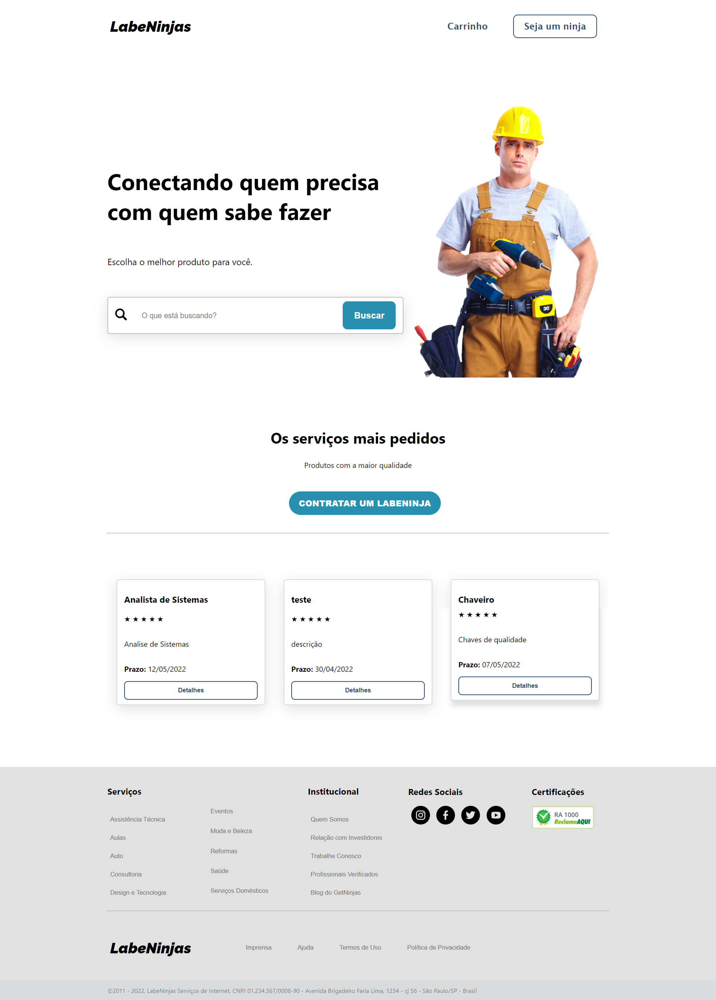

<h1 align="center">Labeninjas</h1>

<p align="center">
  <a href="#-tecnologias">Tecnologias</a>&nbsp;&nbsp;&nbsp;|&nbsp;&nbsp;&nbsp;
  <a href="#-projeto">Projeto</a>&nbsp;&nbsp;&nbsp;|&nbsp;&nbsp;&nbsp;
  <a href="#-website">Website</a>&nbsp;&nbsp;&nbsp;|&nbsp;&nbsp;&nbsp;
  <a href="#-como-executar">Como executar</a>&nbsp;&nbsp;&nbsp;
  


<p align="center"></p>


## 👨‍💻 Tecnologias

Projeto desenvolvido com as seguintes tecnologias:


## 💻 Projeto

Labeninja, uma página fictícia criada para o curso Web-Fullstack da Labenu.
Nosso objetivo era excercer o trabalho em grupo e solidificar os conhecimentos aprendidos em aula durante as semanas.

## 📲 Website

Link para visualização no surge: [polite-boat.surge.sh](surge)

## 🚀 Como executar

 Clonar o repositorio:
```bash
$ git clone https://github.com/future4code/Silveira-labe-ninja6.git
```
Acessar o repertório:
```bash
$ cd polite-boat.surge.sh

```
****
## ✒️ Author

Davi Souza  [https://github.com/Lets-DavIt]</br>
Italo Souza [https://github.com/italosouza09]</br>